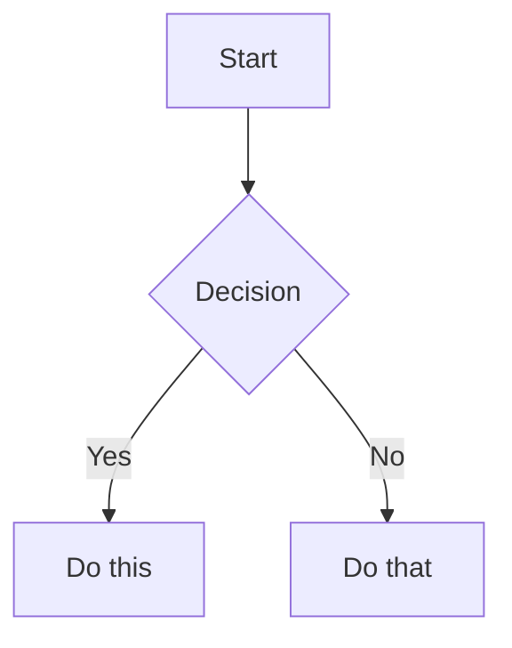

# Obsidian Flavored Markdown Reference

Obsidian extends CommonMark and GFM with wikilinks, embeds, callouts, properties, comments, highlights, and more. This covers only Obsidian-specific extensions — standard Markdown is assumed knowledge.

## Internal Links (Wikilinks)

```markdown
[[Note Name]]                          Link to note
[[Note Name|Display Text]]             Custom display text
[[Note Name#Heading]]                  Link to heading
[[Note Name#^block-id]]                Link to block
[[#Heading in same note]]              Same-note heading link
```

### Block IDs

Append `^block-id` to any paragraph:

```markdown
This paragraph can be linked to. ^my-block-id
```

For lists and quotes, place block ID on a separate line after the block:

```markdown
> A quote block

^quote-id
```

> Use `[[wikilinks]]` for vault notes (Obsidian tracks renames) and `[text](url)` for external URLs.

## Embeds

Prefix any wikilink with `!` to embed inline:

```markdown
![[Note Name]]                         Full note
![[Note Name#Heading]]                 Section
![[Note Name#^block-id]]               Block
![[image.png]]                         Image
![[image.png|300]]                     Image with width
![[image.png|640x480]]                 Image with dimensions
![[document.pdf]]                      PDF
![[document.pdf#page=3]]               PDF page
![[audio.mp3]]                         Audio
```

External images:

```markdown


```

Embed search results:

````markdown
```query
tag:#project status:done
```
````

See [embeds.md](embeds.md) for complete embed reference.

## Callouts

```markdown
> [!note]
> Basic callout.

> [!warning] Custom Title
> Callout with custom title.

> [!faq]- Collapsed by default
> Foldable callout (- collapsed, + expanded).

> [!question] Outer
> > [!note] Nested
> > Nested callout content.
```

Types: `note`, `abstract` (`summary`, `tldr`), `info`, `todo`, `tip` (`hint`, `important`), `success` (`check`, `done`), `question` (`help`, `faq`), `warning` (`caution`, `attention`), `failure` (`fail`, `missing`), `danger` (`error`), `bug`, `example`, `quote` (`cite`).

See [callouts.md](callouts.md) for full reference with CSS customization.

## Properties (Frontmatter)

YAML frontmatter at the start of a note:

```yaml
---
title: My Note
date: 2024-01-15
tags:
  - project
  - active
aliases:
  - Alternative Name
cssclasses:
  - custom-class
status: in-progress
rating: 4.5
completed: false
due: 2024-02-01T14:30:00
---
```

### Property Types

| Type | Example |
|------|---------|
| Text | `title: My Title` |
| Number | `rating: 4.5` |
| Checkbox | `completed: true` |
| Date | `date: 2024-01-15` |
| Date & Time | `due: 2024-01-15T14:30:00` |
| List | `tags: [one, two]` or YAML list |
| Links | `related: "[[Other Note]]"` |

### Default Properties

- `tags` — Searchable labels, shown in graph view
- `aliases` — Alternative names for link suggestions
- `cssclasses` — CSS classes applied to the note

See [properties.md](properties.md) for complete reference.

## Tags

```markdown
#tag                    Inline tag
#nested/tag             Nested tag hierarchy
#tag-with-dashes
#tag_with_underscores
```

Tags can contain: letters (any language), numbers (not first character), underscores `_`, hyphens `-`, forward slashes `/`.

Also definable in frontmatter:

```yaml
---
tags:
  - tag1
  - nested/tag2
---
```

## Comments

```markdown
This is visible %%but this is hidden%% text.

%%
This entire block is hidden in reading view.
%%
```

## Highlights

```markdown
==Highlighted text==
```

## Math (LaTeX)

```markdown
Inline: $e^{i\pi} + 1 = 0$

Block:
$$
\frac{a}{b} = c
$$
```

## Diagrams (Mermaid)

````markdown

````

Link Mermaid nodes to Obsidian notes with `class NodeName internal-link;`.

## Footnotes

```markdown
Text with a footnote[^1].

[^1]: Footnote content.

Inline footnote.^[This is inline.]
```

## Complete Example

````markdown
---
title: Project Alpha
date: 2024-01-15
tags:
  - project
  - active
status: in-progress
---

# Project Alpha

This project aims to [[improve workflow]] using modern techniques.

> [!important] Key Deadline
> The first milestone is due on ==January 30th==.

## Tasks

- [x] Initial planning
- [ ] Development phase
  - [ ] Backend implementation
  - [ ] Frontend design

## Notes

The algorithm uses $O(n \log n)$ sorting. See [[Algorithm Notes#Sorting]] for details.

![[Architecture Diagram.png|600]]

Reviewed in [[Meeting Notes 2024-01-10#Decisions]].
````
